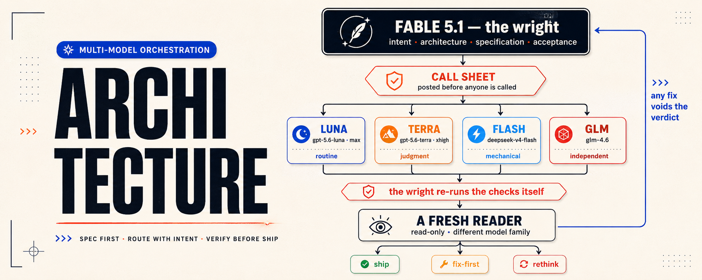
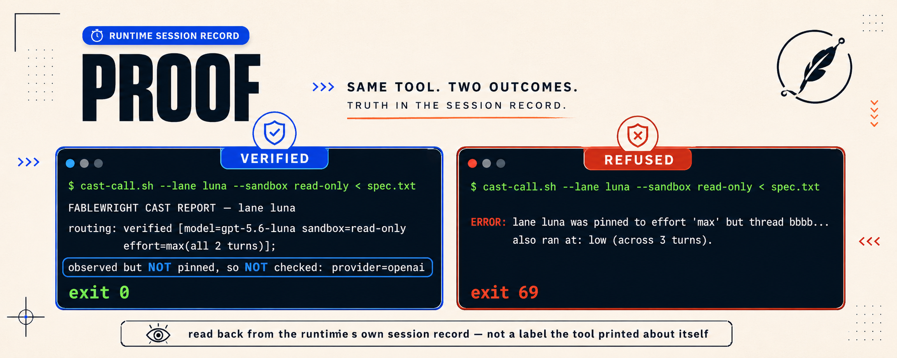
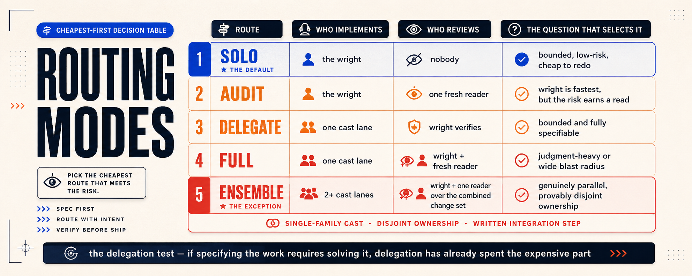

<div align="center">

# FABLEWRIGHT

**play·wright** *(n.)* — writes the play, never walks on stage.

[](https://github.com/divyamtalwar/fablewright/actions/workflows/ci.yml)
[](tests/run-tests.sh)
[](scripts/verify.sh)
[](#quickstart)
[](LICENSE)

**Claude Fable 5.1 writes the specification and accepts the result.
Pinned GPT-5.6, DeepSeek and GLM lanes perform it.
A fresh reader from a different model family returns one verdict.**

Nobody grades their own homework, and no lane is trusted for work it only *claims* to
have done.

</div>



---

## Contents

[Why this exists](#why-this-exists) ·
[Quickstart](#quickstart) ·
[The call sheet](#the-call-sheet) ·
[The cast](#the-cast) ·
[What is guaranteed](#what-is-actually-guaranteed) ·
[When not to use it](#when-not-to-use-this) ·
[Verify it yourself](#verify-it-yourself)

---

## Why this exists

Most multi-agent setups fail the same three ways. FABLEWRIGHT is built to make each one
structurally impossible rather than merely discouraged.

### They delegate to look busy

One agent that finishes beats three that coordinate. The default route is `solo`, and
delegation has to pass a test before it is allowed: *if specifying the work requires
solving it, delegation has already spent the expensive part.* Posting `solo` is a result,
not a failure.

### They let the author grade the work

Same model, same context, same blind spots. FABLEWRIGHT separates authorship from
acceptance, and the reader's model family must differ from the author's. When it cannot,
the call sheet has to say `same-family` out loud and carry it as residual risk.

### They silently substitute

You ask for one model, something else answers, and the output comes back looking
identical. FABLEWRIGHT *proves* the route after the fact and refuses the work when the
evidence disagrees.

```console
$ scripts/ask-wright.sh --model opus --check
ERROR: the pin 'opus' was served by 'claude-opus-5', which does not match
       ^claude-fable-. FABLEWRIGHT does not accept a substitute wright.
```

```console
$ scripts/cast-call.sh --lane luna --cwd "$W" --sandbox read-only < spec.txt
FABLEWRIGHT CAST REPORT — lane luna (fablewright_luna_implementer)
routing: verified [model=gpt-5.6-luna sandbox=read-only effort=max(all 2 turns)];
         observed but NOT pinned, so NOT checked: provider=openai; thread=aaaa...
```

That second line is not a label. It is read back out of the runtime's own session record
after the run. Note what it does **not** claim: this lane pins no provider, so `provider`
is reported as observed rather than folded into the word "verified". Effort is compared
across **every turn**, not just the last, so a lane that quietly dropped to a lower effort
partway through is refused.

```console
ERROR: lane luna was pinned to effort 'max' but thread bbbb... also ran at: low
       (across 3 turns).
```



---

## Quickstart

### Claude Code

The wright is your session model, so run Fable 5.1.

```sh
/plugin marketplace add divyamtalwar/fablewright
/plugin install fablewright@fablewright
```

| command | what it does |
|---|---|
| `/fablewright:setup` | bootstrap: what is present, install profiles, what is optional |
| `/fablewright:preflight` | prove the wright and every lane before trusting one |
| `/fablewright:route <task>` | post a call sheet — routing only, no work |
| `/fablewright:read` | fresh read-only verdict on the current change set |

Run `setup` first. `preflight` diagnoses an install rather than creating one, so on a
fresh machine it correctly reports that nothing is installed yet.

Cast lanes need the Codex CLI on `PATH`, because Claude Code subagents run Claude models.
The reader and scout are native.

> `claude plugin details fablewright@fablewright` reports `Agents (0)`. Both agents do
> load — the inventory counter walks the default `agents/` directory and misses
> manifest-declared paths, which is this layout. Confirmed at runtime:
> `fablewright:fablewright-reader` and `fablewright:fablewright-scout` register with no
> plugin errors.

### Codex

The wright is remote, reached with one hermetic Claude Code call.

```sh
codex plugin marketplace add https://github.com/divyamtalwar/fablewright
codex plugin add fablewright

sh scripts/install-agents.sh --host codex --dry-run
sh scripts/install-agents.sh --host codex
```

Then invoke `$fablewright` and let it post the call sheet before it calls anyone.

Installing lane profiles is deliberately a separate step: installing a plugin registers
skills, not user-owned agent profiles.

---

## The call sheet

Before the first task tool call, exactly one machine-auditable block:

```text
FABLEWRIGHT CALL SHEET
route: solo | delegate | audit | full | ensemble
cast: none | <lane-id>[, <lane-id>...]
reader: none | <lane-id>
independence: cross-family | same-family | not-applicable
risk: <concise, task-specific rationale>
```

A later sheet may only **escalate**, only on newly observed risk, and only with that
evidence written down. It never silently relaxes.

| route | implements | reader | use when |
|---|---|---|---|
| `solo` | the wright | none | bounded, low-risk, reversible, cheap to redo |
| `delegate` | one cast lane | none | bounded, fully specifiable, worth the context |
| `audit` | the wright | one | the wright is the fastest author but the risk earns a read |
| `full` | one cast lane | one | judgment-heavy, high-risk, or wide blast radius |
| `ensemble` | 2+ cast lanes | one | genuinely parallel over **provably disjoint** ownership |

`ensemble` is the exception, not the ambition: disjoint ownership stated per lane before
anyone starts, a written integration step owned by the wright, one reader over the
*combined* change set, and every lane from one model family — because a single reader
cannot be cross-family with two families at once.



---

## The cast

| lane | model | effort | for |
|---|---|---|---|
| `luna` | `gpt-5.6-luna` | `max` | routine, bounded, fully specified implementation |
| `terra` | `gpt-5.6-terra` | `xhigh` | judgment-heavy, high-risk, wide blast radius |
| `flash` | `deepseek-v4-flash` | provider default | mechanical transformation, checkable by command |
| `glm` | `glm-4.6` | provider default | independent cross-family implementation |
| `sol-reviewer` | `gpt-5.6-sol` | `xhigh` | fresh read-only review of non-GPT work |
| `glm-reviewer` | `glm-4.6` | provider default | fresh cross-family review of GPT work |

One pin per lane, written in exactly one place. Both hosts read the same profile: Codex
spawns it natively by `agent_type`, and `cast-call.sh` parses the same file for its model,
effort, sandbox, provider, and standing instructions.

`luna`, `terra` and `sol` resolve against the default OpenAI provider. `flash` and `glm`
need a provider that speaks the OpenAI **Responses** API, pinned with one `model_provider`
line in the lane profile — see
[providers.md](skills/fablewright/references/providers.md). On Codex 0.153.0 `wire_api`
accepts only `responses`, so a chat-completions-only endpoint cannot serve a lane; that is
verified against the binary, not assumed. Until a provider is configured those lanes are
**unavailable**, which is a blocker to report on the call sheet, never a reason to hand
their work to whichever lane happened to answer.

---

## What is actually guaranteed

Claims this repository will not make on your behalf.

- **The wright is proven.** `ask-wright.sh` requires exit 0, `is_error` false,
  `terminal_reason: completed`, zero permission denials, exactly one responding model, and
  that model matching `^claude-fable-`. Anything else is a refusal.
- **The cast is proven, and the proof says what it checked.** After each run,
  `cast-call.sh` reads the thread's own session record and compares the observed model,
  sandbox, and — where the lane pins them — effort and provider. Effort is compared against
  every turn, not just the last. A field with no pin is listed separately as
  observed-but-not-checked, because calling it "verified" would be a lie.
- **Read-only means read-only on Claude Code.** `fablewright-reader` declares
  `tools: Read, Grep, Glob`. It has no write, edit, or execution tool, so it is structurally
  incapable of changing the repository. There is no host policy to broaden. On Codex the
  reviewer *requests* a read-only sandbox, so you must observe what you got — and the docs
  say so instead of pretending otherwise.
- **The installer refuses rather than overwrites.** Symlinked or modified destinations are
  never written. If any role fails preflight, *nothing* is written. State is re-checked
  immediately before each write, and a failure partway through undoes everything that run
  created. Exactly one customization is tolerated — an appended `model_provider = "<id>"`
  line, because provider ids are per user — and only when it is a real TOML key rather than
  a line smuggled inside the instructions block.
- **Unverifiable is not a warning.** `--ephemeral` persists no session, so routing cannot
  be proven; FABLEWRIGHT reports `routing: waived` **and exits 75** rather than claiming a
  proof it does not have. Exit 0 means verified and nothing else.

---

## When not to use this

Orchestration is not free and this repository will not pretend otherwise.

Anthropic's own multi-agent research system reports that **agents use roughly 4x the tokens
of a chat, and multi-agent systems roughly 15x**, and that the architecture pays off only
for breadth-first work with genuinely independent directions — noting plainly that *most
coding tasks do not parallelize well.*
([source](https://www.anthropic.com/engineering/multi-agent-research-system))

Cognition's argument against multi-agent systems is sharper still, and correct: parallel
agents **miscommunicate subtasks** and **make conflicting implicit decisions**, because an
action carries a decision the other agent cannot see.
([source](https://cognition.com/blog/dont-build-multi-agents))

FABLEWRIGHT does not dispute either finding. It is built around them:

- The default route is `solo`. The delegation test has to *pass* before a lane is called,
  and it usually should not.
- Decisions are made by the wright **before** the spawn, not discovered independently by
  lanes afterwards. Architecture, interfaces, and decomposition never leave the wright.
- `ensemble` requires provably disjoint ownership, a written integration step, one reader
  over the combined change set, and a single-family cast.
- Delegated work must *substitute* for the wright's work, never duplicate it. If the wright
  would have to do the task anyway to check it, it was `solo`.

If your task is a single bounded change in one file, use one agent. That is what
`/fablewright:route` will tell you to do, and it is the right answer.

---

## See it work

[docs/WALKTHROUGH.md](docs/WALKTHROUGH.md) is a real run with real output: the wright
posting a call sheet (and catching a spoofed-header quota bug in the requirements while it
was at it), a lane dispatched with proven routing, an unconfigured lane failing closed, and
the installer refusing to overwrite an edited profile without touching a single file.

## Requirements

| | needed for |
|---|---|
| Claude Code CLI | the wright, on either host |
| Codex CLI | cast lanes and routing evidence |
| `jq` | verifying every response; FABLEWRIGHT refuses to run without it |
| POSIX `sh`, `awk`, `find`, `cmp`, `shasum`/`sha256sum` | the scripts |

Nothing here edits your `config.toml`, your `settings.json`, or any credential. Provider
keys live in environment variables named by `env_key`; no key is ever read, printed, or
written by this repository.

## Verify it yourself

```sh
sh tests/run-tests.sh   # 143 offline cases; calls no model, writes only to a temp dir
sh scripts/verify.sh    # manifests, pins, contract wording, links, hygiene, then the suite
```

The suite ships synthetic session fixtures and a stub runtime, so it never reads your real
history and the whole routing-verification path — including a lane that drops below its
pinned effort — is exercised without spending a token. Both gates pass identically on a
runner with neither CLI installed; CI asserts their absence rather than assuming it.

## Layout

```
.claude-plugin/         Claude Code plugin + marketplace manifests
.codex-plugin/          Codex plugin manifest
skills/fablewright/     SKILL.md — the routing contract
  references/           call-sheet · role-contracts · operations · hosts · providers
hosts/codex/agents/     six pinned lane profiles (TOML)
hosts/claude-code/      reader + scout subagents, slash commands
scripts/                ask-wright · cast-call · install-agents · inspect-agent-runtime
                        verify · bump-version
tests/                  offline suite with synthetic rollout fixtures
```

## Contributing

Issues and pull requests are welcome, and the bar is the same one the project holds
itself to: evidence over description.

`main` is protected. Every change arrives as a pull request, CI must be green on both
runners, and the maintainer merges. That is not ceremony — it is the same separation of
authorship and acceptance the tool itself enforces.

```sh
git switch -c fix/short-scope
# change something
sh tests/run-tests.sh      # 143 offline cases, no model calls
sh scripts/verify.sh       # manifests, pins, wording, links, images, then the suite
shellcheck --severity=warning scripts/*.sh tests/*.sh
git push -u origin fix/short-scope
gh pr create
```

Both gates are offline: they call no model, spend no tokens, and write nothing outside a
temporary directory. A green `verify.sh` is the bar.

Before proposing a change to the scripts, read
**[Traps this codebase has already hit](CONTRIBUTING.md#traps-this-codebase-has-already-hit)**.
The code carries no inline commentary, so that section is where the reasoning lives —
every entry is a real defect found in review, not a hypothetical. Changes that weaken
fail-closed behaviour will be declined however convenient they are; the rules are listed
in [CONTRIBUTING.md](CONTRIBUTING.md).

Found something that behaves differently from what the docs promise? Open an issue with
the exact command and its exact output. If a lane was refused, that may be correct — this
tool stops a lane rather than returning work it could not verify — so paste the refusal
and let the evidence settle it.

Security reports go through
[GitHub's private advisory flow](https://github.com/divyamtalwar/fablewright/security/advisories/new),
never a public issue. See [SECURITY.md](SECURITY.md).

## Prior art

The route-gating discipline — declare the route before the first task tool, default to
solo, treat missing routing evidence as a hard stop — follows the pattern established by
[sol-advisor](https://github.com/DannyMac180/sol-advisor) (MIT), which does this for Codex
on a single model family. FABLEWRIGHT keeps that spine and changes three things: the wright
is a different family from the cast, review independence is a checked property rather than
a hope, and every pin is verified against runtime evidence instead of being assumed from
the profile.

## License

MIT — see [LICENSE](LICENSE). Copyright (c) 2026 Divyam Talwar.
